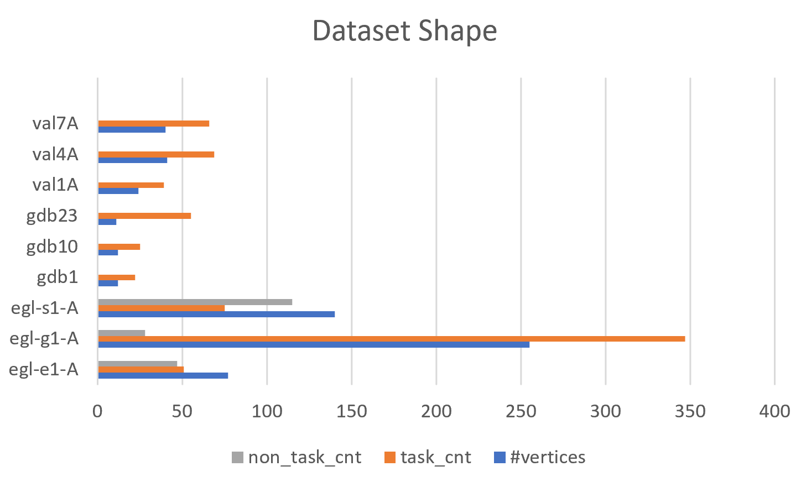
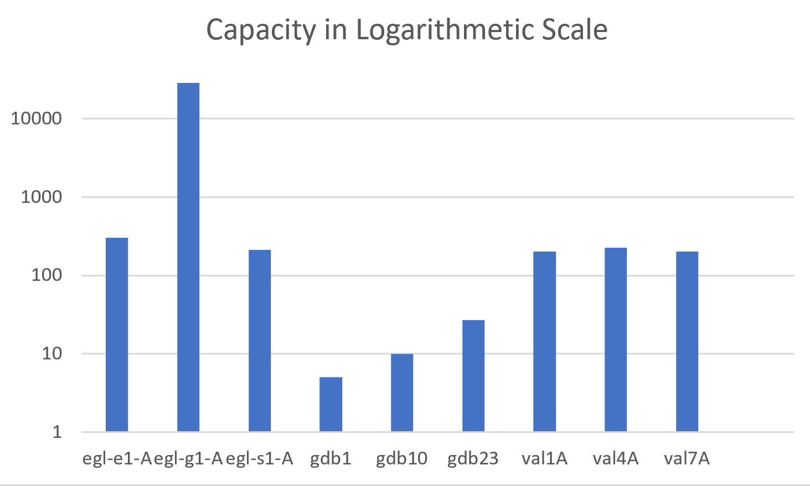

# CS311 CARP Project Report

12110804 方嘉玮

## I. Introduction

The CARP problem, which stands for Capacitated Arc Routing Problem, was formally described in 1981 by Golden and Wong[1] in their paper "Capacitated arc routing problems." The problem was motivated by the need to optimize the routing of vehicles in a variety of transportation and distribution systems, such as garbage collection, mail delivery, and street cleaning. In these applications, the objective is to minimize the total distance traveled by the vehicles while ensuring that each vehicle does not exceed its capacity limit.

The CARP problem is NP-hard, which means that it is unlikely to have an efficient algorithm to solve it exactly in all cases. Therefore, researchers have developed various heuristic and metaheuristic approaches to solve the problem approximately. The problem has also been extended to include more complex constraints and objectives, for example multiple depots [2].

In this project, we study the simplified version of CARP.

### Purpose of the Project

The purpose of this project is to implement a CARP solver, while getting familiar with the problem and possibly various kinds of solvers proposed in the history.

## II. Preliminary

### CARP

#### Definitions

Given an undirected graph $G=(V,E)$, a central vertex, or *depot*, $s \in V$, a cost function $c:E \to \mathbb{N}$, a demand (quantity) function $q:E \to \mathbb{N}$ and capacity $Q$. 

**Required Edge**: A required edge is defined to be an edge that has a positive demand value.

**Route**: A route is defined to be an ordered list of **required** edges, in which each edge $e$ is represented by **an arc** $\tau$, or tuple $(v_{src},v_{dst})$, to identify the direction in which $e$ is traversed.

A route defines a path of fixed cost to traverse from the central depot $s$ to the endpoints of each arc, following the given direction and returning to $s$, where the consecutive arcs' head and tail are connected by the shortest path between them. This path is implicitly defined, and its cost remains constant regardless of which shortest path is taken (in case there are multiple shortest paths connecting a pair of vertices).
$$
R = \{\tau_1, \tau_2, ..., \tau_m\} = \{..., (v_{i_1}, v_{i_2}), ..., (v_{j_1}, v_{j_2}), ...\}
$$
**Task**: The formal name for **an arc** inside a *route*.

**Heads and Tails**: Define $\text{head}(\tau)$ to be the head of arc $\tau$, and $\text{tail}(\tau)$ to be the tail of arc $\tau$.

**Shortest Path between Nodes**: Define $d(v_{src}, v_{dst})$ to be the travelling cost of the shortest path between $v_{src}$ and $v_{dst}$. This can be found using Dijkstra's or Floyd's (in case there are routes with negative cost).

**Cost of A Route**: The total route cost of a route is defined to be
$$
RC(R) = d(s, \text{head}(\tau_1)) + c(\tau_1) + \sum_{i=2}^{|R|}\left( d(\text{tail}(\tau_{i-1}), \text{head}(\tau_i)) + c(\tau_i) \right) + d(\text{tail}(\tau_{|R|}), s)
$$
which simply accumulates the cost of each edge traversed.

**Total Demand of A Route**: The total demand of a route is defined to be:
$$
RD(R) = \sum_{\tau \in R} q(\tau)
$$
**Solution**: A solution is defined to be a set of routes $\{R_1, R_2, ..., R_m\}$.

**Cost of A Solution**: The cost of a solution is defined to be:
$$
TC(S) = \sum_{R \in S} RC(R)
$$

#### Goal

The goal of CARP is to find a set of routes such that each required edge is served exactly once in a route, and the total cost of routes is minimized.

Formally, the goal is to find a solution such that:

- Each *required edge* is **explicitly** contained in the solution exactly once. 
- $\forall R \in S, RD(R) \le Q$
- $TC(S)$ is minimized

### Other Conventional Notations

- $p$ - a parameter of the $\text{Merge-Split}$ operator, denoting the number of routes to select from a solution.
- $K$ - a parameter of the $\text{Merge-Split}$ operator, denoting the maximum number of combinations in a single iteration.
- $TV(S)$ - a function that quantify the number of constraints a solution violates.
- $\lambda$ - a parameter used in evaluating the result of local search.
- $\Tau$ - a list of arcs $\tau_i$.
- $S_p$ - a partial solution, namely a set of routes.

## III. Methodology

### General Workflow

In this project, we implemented a modified version of MAENS [3].

We first generate an initial population. Then, in each iteration we: 

- Do crossovers on the population, producing an offspring.
  - Do a local search around the offspring with certain possibility.
    - Used small-step operator: Single insertion, double insertion and swap.
    - Used big-step operator: Merge-Split.
- After crossover, sort by a stochastic ranking and produce the new population correspondingly.

### Detailed Algorithm

We use the memetic algorithm to solve the problem.

> $\text{Procedure MAENS}$
>
> ​		Randomly initialize the population $P$
>
> ​		Do
>
> ​				Duplicate the population $P$ as $P'$
>
> ​				While *still need to generate new offspring*:
>
> ​						Randomly pick two elements, $S_1$, $S_2$ as parents
>
> ​						Get the child: $S = \text{Crossover}(S_1, S_2)$ [4]
>
> ​						Randomly determine if to do local search around $S$.
>
> ​						If to do local search:
>
> ​								$S = \text{LocalSearch}(S)$
>
> ​						Append $S$ to $P'$
>
> ​				Sort $P'$ by stochastic ranking
>
> ​				Pick the first $n$ elements in $P'$ as the new population. $P \leftarrow P'$
>
> ​		Until **timeout**
>
> ​		Return the best candidate in $P$

> $\text{Procedure LocalSearch}(S)$
>
> ​		While *there are not enough iterations* or *the quality of the solution hasn't change much from last iteration*
>
> ​				$S_1 = \text{SingleInsertion}(S)$
>
> ​				$S_2 = \text{DoubleInsertion}(S)$
>
> ​				$S_3 = \text{Swap}(S)$
>
> ​				$S = \text{The Best of Three}$
>
> ​		While *there are not enough iterations* or *the quality of the solution hasn't change much from last iteration*
>
> ​				$S = \text{The best in $S$ and $\text{Merge-Split}(S)$}$
>
> ​		Return $S$

Single insertion, double insertion and swap are common operations. We emphasize the $\text{Merge-Split}$ procedure.

In the following procedures, $\lambda = \frac{TC(S_{best})}{Q} \left( 1 + \frac{TC(S_{best})}{TC(S)} + \frac{TV(S)}{Q} \right)$ [3]

> $\text{Procedure Merge-Split}(S)$
>
> ​		$n = C(|S|, p)$ // p is a parameter of the $\text{Merge-Split}$ operator
>
> ​		If $n <= K$, *a certain threshold of the $\text{Merge-Split}$ operator*
>
> ​				Do $\text{Merge-Split-Impl}$ on all combinations \
>
> ​						by extracting the selected routes and collect the tasks into an **unordered list** $\Tau$$\Tau$ \
>
> ​						then collect the results
>
> ​		Else
>
> ​				Pick 100 random combinations and do $\text{Merge-Split-Impl}$ on these combinations \
>
> ​						by extracting the selected routes and collect the tasks into an **unordered list** $\Tau$ \
>
> ​						then collect the results
>
> ​		Sort the results by the formula $f(S) = TC(S) + \lambda TV(S)$
>
> ​		Return the best solution $S'$ among the results

In the procedure $\text{Merge-Split-Impl}$, we build five list of routes using the $\text{Path-Scanning}$ heuristic introduced in [3].

> $\text{Procedure Merge-Split-Impl}(\Tau)$
>
> ​		$\{S_{p1}, S_{p2}, S_{p3}, S_{p4}, S_{p5}\} = \text{do Path-Scanning using five additional rules separately}$
>
> ​		Sort the results by the formula $f(S) = TC(S) + \lambda TV(S)$
>
> ​		Return the best solution $S'$ among the results

Since $\text{Path-Scanning}$ (PS) is well-known, we only state the primary rule and the additional five rules when multiple candidate tasks exist. These rules are used to pick the next candidate when forming a partial solution given an unordered list of tasks. Details can be found in [3].

- **Primary Rule**: Satisfy the capacity constraint. If multiple candidates exist, pick the one that is closest to the end of the current path.
- **Additional Rules**
  -  maximize the distance from the head of task to the depot
  -  minimize the distance from the head of task to the depot
  -  maximize the term $q(\tau)/c(\tau)$
  - minimize the term $q(\tau)/c(\tau)$
  - use rule 1) if the vehicle is less than half full, otherwise rule 2).

Code can be found at [CS311_CARP_Solver/CARP_solver.py at main · IskXCr/CS311_CARP_Solver (github.com)](https://github.com/IskXCr/CS311_CARP_Solver/blob/main/CARP_solver.py). The version submitted on [SUSTech Spaces](spaces.sustech.edu.cn) is the wrong one.

### Analysis

The optimality of the algorithm is guaranteed by the characteristic of the evaluation function $f(S) = TC(S) + \lambda TV(S)$ if the algorithm has enough time. When selecting the best solution from a population, only those feasible solutions will be considered. 

**Deciding Factor of the Performance**: The performance of the algorithm relies on certain internal parameters.

| Parameter  | Meaning                                                      |
| ---------- | ------------------------------------------------------------ |
| $psize$    | The size of the population                                   |
| $ubtrial$  | Upper bound for initial trials                               |
| $opsize$   | Number of offspring produced in each generation              |
| $prob\_ls$ | Probability to conduct a local search                        |
| $p$        | Number of routes involved in the $\text{Merge-Split}$ operator |
| $gen\_cnt$ | Number of generations involved. In this project there is only time constraint. |
| $\lambda$  | Penalty coefficient for evaluating the violation of constraints of a given solution (compared to the current best). |

External parameters of the given input will also determine the performance.

| Parameter        | Meaning                 |
| ---------------- | ----------------------- |
| $n$              | Number of vertices      |
| $task\_cnt$      | Count of tasks          |
| $non\_task\_cnt$ | Count of non-task edges |
| $Q$              | Capacity                |
| $t\_cost$        | Total cost of all tasks |

Besides parameters, the implementation of the $\text{Merge-Split}$ operator determines the ability of the algorithm to step out of the local optima and reach the global optima. In this modified MAENS implementation Ullusoy's split is not used, leading to a worsened performance.

## IV. Experiments

### Setup

| Name                 | Specification                                                |
| -------------------- | ------------------------------------------------------------ |
| CPU                  | i7-1165G7 4C8T @2.80 GHz                                     |
| RAM                  | 8 Channel LPDDR4 4266MHz                                     |
| Python Version       | 3.10.10 (tags/v3.10.10:aad5f6a, Feb  7 2023, 17:20:36) [MSC v.1929 64 bit (AMD64)] |
| `numpy` Version      | 1.24.2                                                       |
| Maximum #thread used | 8                                                            |

**Dataset** [5] and Project `CARP_samples`

Datasets of different sizes and shapes are gathered for experiment. The *shape* of a dataset, in this context, is defined to be the relative relations between sizes of `non_task_cnt`, `task_cnt` and `#vertices` of that dataset. The diversity of the dataset contributes to the completeness of the experiment.

### Result

`seed=2333`

The second and the third column contains our result.

| Dataset  | 10s Result | 300s Result | Reference MAENS [3]     | $\text{TSA}_{\text{best}}$ [3] |
| -------- | ---------- | ----------- | ----------------------- | ------------------------------ |
| egl-e1-A | 4151       | 3713        | 3548                    | 3548                           |
| egl-g1-A | 1513611    | 1349376     | 964014 (MAENS*-IIa) [6] | \                              |
| egl-s1-A | 6501       | 5481        | 5018                    | 5018                           |
| gdb1     | 321        | 316         | 316                     | 316                            |
| gdb10    | 311        | 283         | 275                     | 275                            |
| gdb23    | 259        | 238         | 233                     | 233                            |
| val1A    | 183        | 178         | 173                     | 173                            |
| val4A    | 466        | 420         | 400                     | 400                            |
| val7A    | 342        | 298         | 279                     | 279                            |

Different population size and the result of convergence:

| Dataset  | 60s, $psize=30$ | 60s, $psize=60$ | 60s, $psize=120$ |
| -------- | --------------- | --------------- | ---------------- |
| egl-e1-A | 3727            | 3854            | 3959             |
| egl-g1-A | 1419494         | 1385191         | 1366565          |
| egl-s1-A | 5727            | 5930            | 6167             |
| gdb10    | 283             | 277             | 290              |
| val1A    | 178             | 178             | 178              |
| val4A    | 436             | 436             | 455              |
| val7A    | 307             | 321             | 321              |

#### Analysis

The results of our implementation is acceptable when the size of input is small. As the input enlarges the performance starts to deteriorate. This is expected, as the implementation of the $\text{Merge-Split}$ operator isn't well designed and it is possible that the operator couldn't jump out of the local optima.

Enlarging the size of population doesn't necessarily incur a faster convergence in the experiment (**given a time limit**). Our assumption is that increasing the size of population also decreases the number of iterations in the MAENS algorithm, which in some cases leads to a slower evolution, resulting in generally bad performance. In the other cases with larger input, such modification incurs a larger variance that results in a better local optima being enqueued.

The implementation doesn't use a stochastic ranking but instead rank according to $f(S) = TC(S) + \lambda TV(S)$, leading to a potential trap in the local optima.

The implementation is also not well optimized in terms of **overall** performance, leading to a very slow convergence.

## V. Conclusions

Advantages of the algorithm:

- Easy to form the initial idea and implement.
- Clear design.

Disadvantages:

- Heavy tunings on parameters are required to achieve better result.
- Implementation of the local search operator determines the quality of local search - poor implementation of the operators leads to much slower convergence.
- Hard to design the evaluation function.

Does the experimental result match our expectation?

- Yes, as the MS operator is not well designed and lacks tuning. There is also **no constraint violation** in the offspring produced, which may significantly decrease the algorithm's possibility to jump out of the local optima.

Lessons learned from this project:

- Check the version of the file before submission.
- Get the framework done in a clean fashion to ease the process of tuning later on.
- To implement a fast program in Python requires heavy tuning using potentially `cProfile` and other modules to investigate the performance bottleneck.

Further thoughts on how it can be improved:

- Optimize the local search operators. Specifically, the $\text{Merge-Split}$ operator. Ullusoy's splitting procedure can be applied.
- Produce solutions that violates constraints to further improve the versatility of the solution set.
- Optimize the evaluation function and try to jump out of the local optima.

## References

[1] Golden, B.L. and Wong, R.T. (1981), Capacitated arc routing problems. Networks, 11: 305-315. https://doi.org/10.1002/net.3230110308

[2] A. Kansou and A. Yassine, "A two ant colony approaches for the multi-depot capacitated arc routing problem," *2009 International Conference on Computers & Industrial Engineering*, Troyes, France, 2009, pp. 1040-1045, doi: 10.1109/ICCIE.2009.5223923.

[3] K. Tang, Y. Mei and X. Yao, "Memetic Algorithm With Extended Neighborhood Search for Capacitated Arc Routing Problems," in *IEEE Transactions on Evolutionary Computation*, vol. 13, no. 5, pp. 1151-1166, Oct. 2009, doi: 10.1109/TEVC.2009.2023449.

[4] Yuning Chen, Jin-Kao Hao, Fred Glover, A hybrid metaheuristic approach for the capacitated arc routing problem, *European Journal of Operational Research*, Volume 253, Issue 1, 2016, Pages 25-39, ISSN 0377-2217, https://doi.org/10.1016/j.ejor.2016.02.015.

[5] [Capacitated Arc Routing Problem (uv.es)](https://www.uv.es/belengue/carp.html)

[6] Consoli, Pietro & Minku, Leandro. (2014). Dynamic Selection of Evolutionary Algorithm Operators Based on Online Learning and Fitness Landscape Metrics. *Soft Computing*. 20. 359-370. 10.1007/978-3-319-13563-2_31. 